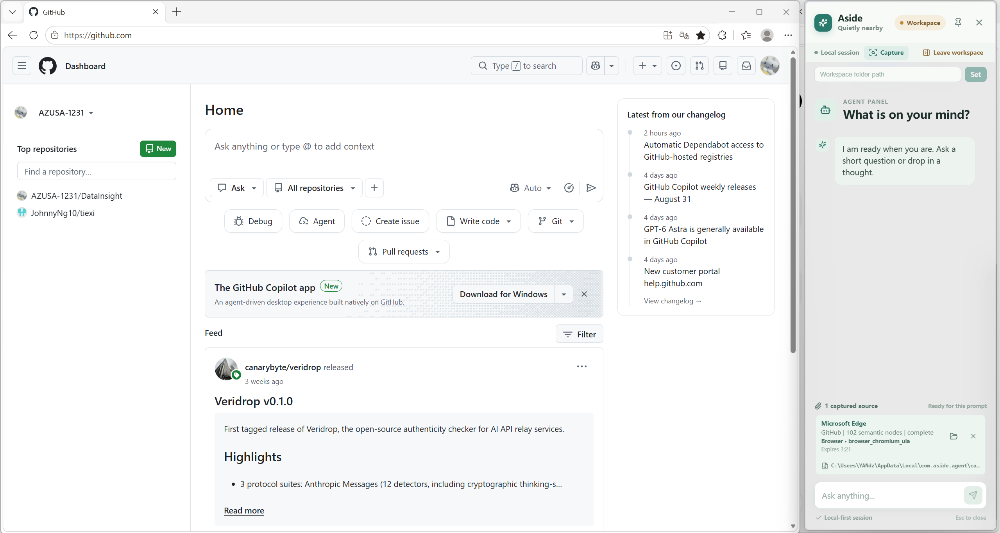
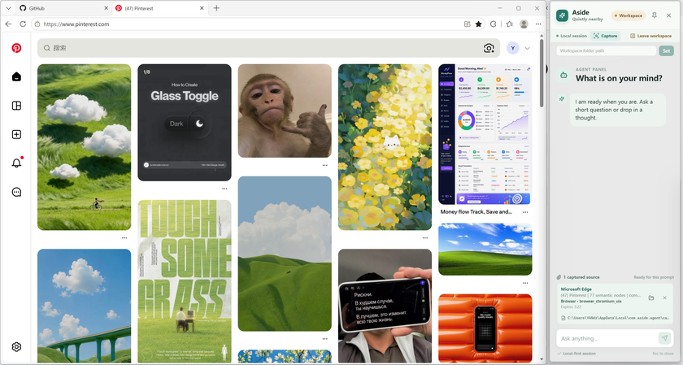

# Aside

<p align="center">
  
  
</p>

> **Status: work in progress** — a semi-finished MVP, and a development build.
> The desktop shell, window behavior, agent runtime, bounded host-context
> capture, bounded permission-gated workspace tools, PDF and Word handling, and
> a user-connected MCP tool adapter are implemented.
>
> An independent audit of Cycle 6 found twelve defects; all twelve are fixed
> with regression tests, and Cycle 6's acceptance remains **blocked** pending
> re-verification and a manual Windows pass. Nothing here is released, and no
> installable build is produced yet — packaging is Cycle 7 work. Everything
> below describes what the code does, not what has been signed off.

Aside is a persistent desktop companion for Windows. It's a small frameless
side panel you can summon from anywhere with `Ctrl + Alt + A` — always within
reach, never taking over the screen.

Built with **Tauri 2**, **React**, **TypeScript**, and **Pi's agent core**.

## Features

- **Frameless side rail** — a consistent full-height panel near the right edge
  of the active display.
- **Summon from anywhere** — a global `Ctrl + Alt + A` shortcut shows, hides,
  and focuses the panel.
- **Pin mode** — keep Aside above other windows.
- **Workspace Mode** — temporarily gives ~80% of the work area to the active
  maximized application and 20% to Aside, restoring the original window state
  when you leave.
- **Bounded host context** — the agent reads limited context from the current
  window (browser pages, Explorer, PDF, Word, Excel paths) via Windows UI
  Automation, without reading file contents or unbounded screen data.
- **Automatic workspace handoff** — capturing a file resolves the containing
  directory as the task workspace before any file tool call. Capture is a
  reference, not permission; the runtime canonicalizes and revalidates it.
- **Bounded workspace tools** — list, stat, read, and search text and JSON
  files inside the resolved workspace, without a shell or a process-wide
  working-directory change.
- **Permission-gated writes** — text and JSON writes and edits are prepared,
  previewed, and executed once after an exact-operation decision. Approved
  operations are revalidated against the current target before they run.
- **Skills** — three bundled bounded `SKILL.md` workflows. Skill content is
  untrusted reference data: it can never register a tool or expand authority.
- **Task-aware Side rail** — workspace, active skill, tool activity,
  verification, and permission controls, all display projections over the
  runtime's serialized state.

## Getting started

**Prerequisites:** Node.js 22.19+, Rust with the MSVC toolchain, and the
standard Tauri Windows prerequisites (WebView2, Visual Studio Build Tools).

```powershell
npm.cmd install
npm.cmd run tauri dev
```

The window starts hidden — press `Ctrl + Alt + A` to show or hide it.

## Provider configuration

Copy [.env.example](.env.example) to `.env.local` and fill in your provider
credential. Aside loads it automatically at startup:

```text
ASIDE_PROVIDER=openai
ASIDE_MODEL=gpt-4o-mini
ASIDE_API_URL=https://api.openai.com/v1
OPENAI_API_KEY=your-key
```

`ASIDE_API_URL` is optional and useful for an OpenAI-compatible gateway or a
local server. `.env.local` is git-ignored; packaged builds also read
`%LOCALAPPDATA%\Aside\config.env`.

## Roadmap

The current MVP covers the desktop and window experience, the agent runtime,
bounded UIA-based host-context capture, and bounded permission-gated workspace
tools. Cycle 6 added PDF reading, Word reading and transformation, and a
user-connected MCP tool adapter, all through one Aside-owned capability
registry and policy path.

Cycle 7 is planned and not started. It covers the frontend test infrastructure
Cycle 6 lacked, surface interaction quality, an MCP configuration surface,
settings reload, conversation management, classification binding, and the
installable build. Each unit is scoped to one demonstrable result, because
Cycle 6's layer-by-layer split is what let it grow past one cycle.

Aside bundles no MCP server and ships no default server configuration. You
connect your own, and the adapter applies Aside's policy, permission, bounds,
and result normalization to whatever it exposes.

Deferred for now:

- shell, PowerShell, and arbitrary process or code execution
- Excel, PowerPoint, GitHub, VSCode actions, Notion, and general browsing
- Web Search. Considered for Cycle 6 and removed: a built-in would mean
  adopting one provider's contract and terms, and every keyless option
  reachable over MCP is a scraper. Not built, and no server is bundled to
  reach it.
- PDF mutation and OCR, and full Word round-trip fidelity
- an installable build: packaging and installed-application support are Cycle 7
- permanent workspace trust, multi-workspace execution, and background agents
- VSCode bridge and active-editor integration
- Rich production host extraction
- Windows Widget / Shell integration, browser extensions, DOM access, and OCR

No shell or process capability is registered in the model-visible tool schema,
including as a disabled placeholder.
